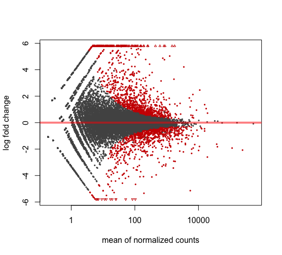

### Steps taken to perform differential expression analysis ###

Mouse genome and annotations downloaded from [Ensembl](https://uswest.ensembl.org/Mus_musculus/Info/Index)

[STAR](https://github.com/alexdobin/STAR/blob/master/doc/STARmanual.pdf) for genome indexing

First attempt indexing with separate files for each chromosome, but forgot the MT. Seccond attmept, with single file for whole genome worked and ran as follows:

`./STAR --runThreadN 4 --runMode genomeGenerate --genomeDir /Users/blakegabel/Documents/DiNardo/genome --genomeFastaFiles /Users/blakegabel/Documents/DiNardo/Mus_musculus/* --sjdbGTFfile /Users/blakegabel/Documents/DiNardo/Mus_musculus.GRCm38.99.gtf --sjdbOverhang 75`

STAR for alignment of RNA-seq data

`./STAR --runThreadN 4 --genomeDir /Users/blakegabel/Documents/DiNardo/genome --readFilesIn <(gunzip -c /Users/blakegabel/Documents/DiNardo/rna_data/FB*) --outFileNamePrefix /Users/blakegabel/Documents/DiNardo/mappedReads/ --outSAMtype BAM SortedByCoordinate`

I let this run for over 48 hours, but it did not complete. I realized that it was mapping all files to a single output, which is definetly unwanted; so I decided to run each file one by one. The updated command is as follows:

`./STAR --runThreadN 4 --genomeDir /Users/blakegabel/Documents/DiNardo/genome --readFilesIn {file_name} --outFileNamePrefix /Users/blakegabel/Documents/DiNardo/FB_mapped/ --outSAMtype BAM SortedByCoordinate --limitBAMsortRAM 12000000000`  

After running this command on the first four files, I realized that I need to count the number of times each mapped gene aligns to an exon within the genome. This was done by for the already aligned reads. The counts were done using a non-strand specific method as I do not know if the original data is strand specific.

`htseq-count -s no -c ./FB_mapped/{file_name}_ReadsPerGene.out.tab ./FB_mapped/{file_name}_Aligned.sortedByCoord.out.bam ./Mus_musculus.GRCm38.99.gtf`

And for the remaining files, STAR gives an option to perform this same count as it aligns the reads and I realized I do not need aligned files:

`./STAR --runThreadN 4 --genomeDir /Users/blakegabel/Documents/DiNardo/genome --readFilesIn file --outFileNamePrefix /Users/blakegabel/Documents/DiNardo/FB_mapped/ --outSAMtype BAM Unsorted --quantMode GeneCounts`

Differential analysis on the fibroblast data resulted in approximately 18500 genes with non-zero read count using [DESeq2](http://bioconductor.org/packages/devel/bioc/vignettes/DESeq2/inst/doc/DESeq2.html#more-information-on-results-columns). Only the fibroblast data was used due to the time required to align all the files and the other files had ambiguous names, so I could no determine what the data correlated with. The next step only looked at genes with a p-value < 0.05. Of these, 1033 (5.6%) were upregulated in fibroblasts cocultured with mast cells, while 885 (4.8%) were downregulated. Here is the initial plot of the log2 fold changes. Points highlighted in red represent p-values < 0.05

Next, I annotated the genes with their common gene name, description, chromosome, start, and end positions. The genes with the smallest p-values are as follows:

| Gene ID | Name | p-value | log2FoldChange |
| --- | --- | --- | --- |
| ENSMUSG00000005672 | Kit | 1.913E-192 | 5.033 |
| ENSMUSG00000018593 | Sparc | 7.554E-175 | -2.604 |
| ENSMUSG00000020572 | Nampt | 7.451E-170 | 3.283 |
| ENSMUSG00000024173 | Tpsab1 | 1.321E-157 | 8.375 |
| ENSMUSG00000022665 | Ccdc80 | 1.427E-147 | -2.931 |
| ENSMUSG00000015053 | Gata2 | 4.106E-143 | 4.871 |
| ENSMUSG00000025185 | Loxl4 | 3.612E-123 | -2.915 |
| ENSMUSG00000022330 | Osr2 | 2.247E-113 | -3.266 |
| ENSMUSG00000032332 | Col12a1 | 3.442E-111 | -2.328 |
| ENSMUSG00000001506 | Col1a1 | 2.355E-109 | -2.075 |
